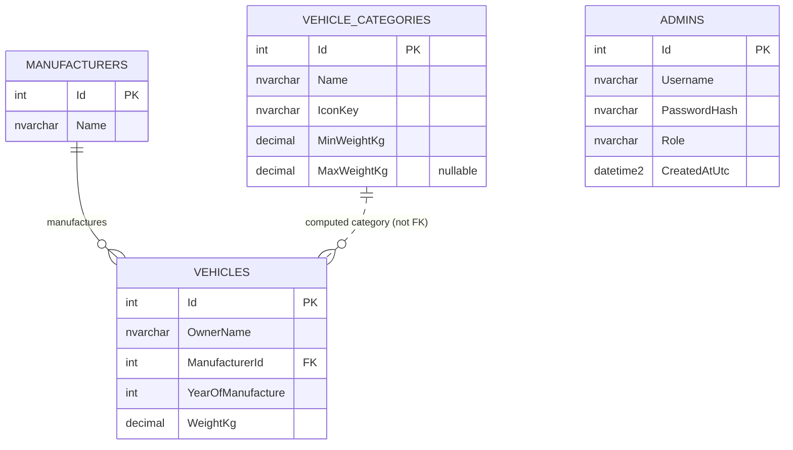

# CreditWorks Vehicle Management App — Build Instructions

> This document is written to be handed to Claude (or another developer) as a self-contained brief for implementing the application. It captures the original assignment requirements plus the design decisions made for this build. Where a decision was made without explicit confirmation, it is flagged as an **Assumption**.

---

## 1. Project Summary

A web application for managing **vehicles** and the **weight categories** they're automatically sorted into. Categories are user-configurable (name, icon, weight range), and every vehicle's category must always reflect the *current* category configuration — never a stale, stored value.

---

## 2. Confirmed Tech Stack

| Layer | Choice |
|---|---|
| Backend | **C# / ASP.NET Core Web API** |
| Data access | **Entity Framework Core** (Code-First, migrations) |
| Database | **Microsoft SQL Server Express**, running locally (not containerized) |
| Frontend | **React** (SPA, consuming the backend via REST/JSON) |
| Category → vehicle relationship | **Computed on read** — a vehicle's category is *never stored*; it's derived from `WeightKg` + the current category ranges every time it's requested |
| Category icons | **Icon library key** — a string referencing a preset icon name from `lucide-react` (e.g. `"Feather"`, `"Truck"`, `"Container"`); no image upload/storage needed |

### 2.1 Assumptions made to fill remaining gaps
*(Following each with a brief rationale; revisit any of these if you'd prefer something different.)*

- **Frontend tooling**: Vite + TypeScript + React Router + Tailwind CSS. Data fetching via a thin `fetch`-based API client (no heavy state library needed for an app this size).
- **Backend project shape**: a single ASP.NET Core Web API project with folders for `Controllers`, `Services` (business rules), `Data` (EF Core `DbContext`, migrations), and `Models`/`DTOs` — layered, but not split into separate class libraries (per the assignment's "don't over-architect" guidance).
- **Year of Manufacture bounds**: valid range is `1886` (the year the first automobile was built) through `current year + 1` (to allow next-model-year vehicles). Enforced server-side.
- **Weight precision**: stored as `decimal(10,2)` in SQL Server — supports up to 99,999,999.99 kg, comfortably beyond any real vehicle.
- **Category range convention**: a category's range is **`[Min, Max)`** — inclusive lower bound, exclusive upper bound. So a vehicle at exactly `500.00 kg` belongs to the category whose `Min = 500`, not the one whose `Max = 500`. This directly resolves the "boundary handling" requirement from the original brief.
- **Coverage floor**: since weight must be strictly positive (`> 0`), the full valid domain to cover is `(0, ∞)`. This means: the lowest category's `Min` must always be `0`, and the highest category's `Max` must always be `NULL` (meaning unbounded/infinity). This invariant is enforced on every category create/edit/delete.
- **Auth**: none implemented (per assignment, not required). Noted as a known production gap in the README.
- **API style**: plain REST/JSON, no GraphQL/gRPC — keeps things simple and framework-agnostic for the React client.

**Open questions you may still want to weigh in on** (safe defaults have been assumed above, implementation can proceed either way):
- Should the admin category-management screen be part of the initial build, or genuinely deferred to a "phase 2" release? (Currently planned as in-scope — see §7.2 for how it's isolated so it *could* be deferred without blocking the rest, though the original assignment already requires full category CRUD.)
- Any preferred visual style/branding (colors, logo) for the React UI, or is a clean generic look fine?

---

## 3. Core Entities & Business Rules

### 3.1 Manufacturer
- Predefined, seeded list: `Mazda, Mercedes, Honda, Ferrari, Toyota`.
- Modeled as its own table/entity (not a hardcoded enum or embedded string) so new manufacturers can be added later without code changes.

### 3.2 Vehicle Category
- Fields: `Name` (required, unique), `IconKey` (required), `MinWeightKg` (required), `MaxWeightKg` (nullable — `NULL` = unbounded top category).
- **Invariants enforced on every create/update/delete:**
  1. **No gaps**: the set of ranges, sorted by `Min`, must be perfectly contiguous — each category's `Max` must equal the next category's `Min`.
  2. **No overlaps**: implied by the contiguity check above, but validated explicitly too.
  3. **Full coverage**: lowest `Min = 0`; highest `Max = NULL`.
  4. **Deleting or editing** a category is rejected (with a clear error) if it would break any of the above invariants. (There is no "orphaned vehicle" risk in this design since category is computed, not stored — but *coverage* must never break, or some vehicles would resolve to zero categories.)

### 3.3 Vehicle
- Fields: `OwnerName`, `ManufacturerId` (FK), `YearOfManufacture`, `WeightKg`.
- All fields mandatory; validated server-side regardless of client-side checks.
- `Category` is **not a column** — it's computed at query time from `WeightKg` against the current `VehicleCategories` table.

### 3.4 Admin (authentication)
The Category Administration page (§7) is gated behind a login. Design:

- A dedicated `Admins` table stores credentials — **not** mixed into any other table.
- Passwords are stored **hashed** (e.g. ASP.NET Core's `PasswordHasher<T>`, PBKDF2-based) — never plaintext.
- Login flow (**revised to use an `httpOnly` cookie instead of `sessionStorage`**):
  1. Admin submits username + password to `POST /api/auth/login`.
  2. Backend verifies the hash; on success, issues a signed **JWT** (see §5.1 for claims/format) and sets it as an `httpOnly`, `Secure`, `SameSite=Strict` cookie in the response — the JWT is **never exposed to JavaScript at all**.
  3. Every subsequent request from the browser to the API automatically includes the cookie (frontend just needs `credentials: "include"` on its `fetch` calls) — no manual token attachment needed.
  4. Because the token is `httpOnly`, the frontend **cannot** decode or inspect it directly. Instead, before rendering the admin page, the frontend calls `GET /api/auth/session` (see §5.1). The backend validates the cookie's JWT (signature + expiry) exactly as it would for any protected endpoint, and responds either:
     - `200` with `{ username, role, exp }` — frontend renders the admin UI and can show "Logged in as {username}" / a session-expiry hint.
     - `401` — frontend shows the login form and, if this happened *after* the admin was already in the app (e.g. token expired mid-session), a message like "Your session has expired — please log in again."
  5. `POST /api/auth/logout` clears the cookie server-side (since `httpOnly` cookies can't be cleared by frontend JS) — call this on an explicit logout action.
- **Why this is stronger than the earlier `sessionStorage` design**: an `httpOnly` cookie is invisible to any JavaScript running on the page, so it's no longer a viable target for XSS-based token theft. The trade-off is that cookie-based auth reintroduces **CSRF** risk (the browser now attaches the cookie to requests automatically, including ones triggered from another site) — `SameSite=Strict` is the primary mitigation here and is sufficient for this exercise's scope; a double-submit CSRF token is a further hardening option worth noting in the README as a "if this went to production" item, not something required now.
- **Still true, and worth repeating**: the `/auth/session` call is a UX convenience for deciding what to render — the *real* enforcement is still the backend independently validating the cookie's JWT (via ASP.NET Core's JWT Bearer middleware + `[Authorize(Roles = "Admin")]`) on every protected request. A client-side "am I logged in" check can never be the actual security boundary.
- **Implementation note**: ASP.NET Core's JWT Bearer middleware reads from the `Authorization` header by default. To validate the cookie instead, hook `OnMessageReceived` in the JWT Bearer options to pull the token out of the request's cookie collection — easy to miss if scaffolding from a standard bearer-token tutorial.
- Token lifetime: short-lived (60–120 minutes recommended), no refresh-token flow — simplest option that satisfies "admin re-authenticates periodically" without building revocation/refresh machinery the assignment doesn't call for.
- Seeding: one default admin account is seeded for local dev/review (e.g. `admin` / a documented placeholder password). README must call out that this is a dev-only default and should never be used as-is in production.

---

## 4. Database Schema



> `Admins` has no relationship to the other tables — it exists solely to gate access to the Category Administration screen and endpoints.

> Note: the dotted line to `VEHICLE_CATEGORIES` represents a *logical*, computed relationship — there is intentionally no foreign key from `Vehicles` to `VehicleCategories` in the schema.

### 4.1 Table Definitions

**Manufacturers**
| Column | Type | Constraints |
|---|---|---|
| Id | `int` | PK, identity |
| Name | `nvarchar(100)` | Required, unique |

**VehicleCategories**
| Column | Type | Constraints |
|---|---|---|
| Id | `int` | PK, identity |
| Name | `nvarchar(50)` | Required, unique |
| IconKey | `nvarchar(50)` | Required |
| MinWeightKg | `decimal(10,2)` | Required, `>= 0` |
| MaxWeightKg | `decimal(10,2)` | Nullable (`NULL` = unbounded) |

**Vehicles**
| Column | Type | Constraints |
|---|---|---|
| Id | `int` | PK, identity |
| OwnerName | `nvarchar(200)` | Required |
| ManufacturerId | `int` | FK → Manufacturers.Id, required |
| YearOfManufacture | `int` | Required, range-checked (see §2.1) |
| WeightKg | `decimal(10,2)` | Required, `> 0` |

**Admins**
| Column | Type | Constraints |
|---|---|---|
| Id | `int` | PK, identity |
| Username | `nvarchar(100)` | Required, unique |
| PasswordHash | `nvarchar(max)` | Required — hashed via `PasswordHasher<T>` (PBKDF2), never plaintext |
| Role | `nvarchar(50)` | Required, default `"Admin"` (kept as a column rather than hardcoded, for future extensibility even though only one role exists today) |
| CreatedAtUtc | `datetime2` | Default `GETUTCDATE()` |

### 4.2 Seed Data

```
Manufacturers: Mazda, Mercedes, Honda, Ferrari, Toyota

VehicleCategories:
  Light   { Min: 0,     Max: 500,   IconKey: "Feather" }
  Medium  { Min: 500,   Max: 2500,  IconKey: "Truck" }
  Heavy   { Min: 2500,  Max: null,  IconKey: "Container" }

Admins:
  { Username: "admin", PasswordHash: <hash of a documented placeholder password>, Role: "Admin" }
  # README must flag this as a dev-only default credential — not for production use.
```

### 4.3 Migrations
- Use EF Core **Code-First migrations**. Initial migration creates all three tables plus seed data (via `HasData` in `OnModelCreating`, or a seeding step in `Program.cs` run on startup for local dev).
- README must document: `dotnet ef database update` (or equivalent) as the standard setup step.

---

## 5. API Contract

Base path: `/api`

### Vehicles
| Method | Route | Description |
|---|---|---|
| `GET` | `/vehicles?sortBy={ownerName\|manufacturer\|year\|weight}&sortDir={asc\|desc}` | List all vehicles, each enriched with computed category (`categoryName`, `categoryIconKey`) |
| `GET` | `/vehicles/{id}` | Get a single vehicle |
| `POST` | `/vehicles` | Create a vehicle |
| `PUT` | `/vehicles/{id}` | Edit a vehicle *(not explicitly required by the original brief, but trivial to include given `POST` exists — optional)* |
| `DELETE` | `/vehicles/{id}` | Delete a vehicle *(same note as above — optional nice-to-have)* |

**Vehicle response shape:**
```json
{
  "id": 1,
  "ownerName": "John Smith",
  "manufacturerId": 1,
  "manufacturerName": "Mazda",
  "yearOfManufacture": 2019,
  "weightKg": 480.50,
  "categoryName": "Light",
  "categoryIconKey": "Feather"
}
```

### Manufacturers
| Method | Route | Description |
|---|---|---|
| `GET` | `/manufacturers` | List all manufacturers (for populating the "Add Vehicle" dropdown) |

### Vehicle Categories 🔒 *(all endpoints require a valid Admin JWT — see §5.1)*
| Method | Route | Description |
|---|---|---|
| `GET` | `/categories` | List all categories, ordered by `MinWeightKg` |
| `POST` | `/categories` | Create a category (validated against gap/overlap/coverage rules) |
| `PUT` | `/categories/{id}` | Edit a category's name, icon, or range (same validation) |
| `DELETE` | `/categories/{id}` | Delete a category (rejected if it would break coverage) |

> Note: the main Vehicle List page never calls `/categories` directly — each vehicle's `categoryName`/`categoryIconKey` is already included in the `/vehicles` response (computed server-side). So protecting all of `/categories` behind login doesn't affect the public-facing vehicle list at all; it only gates the admin screen.

### Auth
| Method | Route | Description |
|---|---|---|
| `POST` | `/auth/login` | Body: `{ "username": "...", "password": "..." }`. On success: sets the JWT as an `httpOnly` cookie and returns `200` with `{ username, role, expiresAtUtc }` (body has no token — it's cookie-only). `401` on bad credentials (generic message, doesn't reveal which field was wrong). |
| `GET` | `/auth/session` | No body. Validates the cookie's JWT server-side. `200` + `{ username, role, exp }` if valid; `401` if missing/invalid/expired. Called by the frontend on mount of any admin route to decide what to render. |
| `POST` | `/auth/logout` | Clears the auth cookie server-side (overwrites with an expired one). `200` on success. |

#### 5.1 JWT format
```json
{
  "sub": "<admin id>",
  "username": "<username>",
  "role": "Admin",
  "iat": 1735000000,
  "exp": 1735007200,
  "iss": "CreditWorksVehicleApp",
  "aud": "CreditWorksVehicleApp"
}
```
- `sub` and `exp` are standard claims ASP.NET Core's JWT Bearer middleware understands natively — map them so `[Authorize(Roles = "Admin")]` works on the category controller without custom validation code.
- Signed with **HS256**, secret key from configuration (`appsettings.Development.json`/user-secrets — never committed).
- Expiry: 60–120 minutes; no refresh-token flow (see §3.4 for rationale).
- **Delivery**: the JWT itself never appears in any HTTP response body or in `document.cookie`-readable form — it's set via `Set-Cookie` with `httpOnly` on `POST /auth/login`, and the browser attaches it automatically (given `credentials: "include"` on fetch calls) to every subsequent same-site request. The frontend never stores or decodes the raw token; it only ever sees the *result* of `GET /auth/session`.

### Error format
Use the standard ASP.NET Core **`ProblemDetails`** (RFC 7807) shape for all error responses, e.g.:
```json
{
  "type": "https://tools.ietf.org/html/rfc7231#section-6.5.1",
  "title": "Validation failed",
  "status": 400,
  "errors": {
    "weightKg": ["Weight must be a positive number with at most 2 decimal places."]
  }
}
```
- `400` — validation errors (bad input, would-break-invariant category edits).
- `404` — record not found.
- `409` — conflict (e.g. deleting a category that's the only one left — coverage would break).
- `500` — unhandled server error, generic message only, no stack trace to the client (log server-side).

---

## 6. Category Range Validation — Implementation Approach

Centralize this in a single service, e.g. `CategoryRangeValidator`:

1. Load all existing categories (excluding the one being edited/deleted, including the one being added/edited with its *proposed* new values).
2. Sort by `MinWeightKg`.
3. Check:
   - First category's `Min == 0`.
   - Last category's `Max == null`.
   - For every consecutive pair, `current.Max == next.Min` (no gap, no overlap by construction).
4. If any check fails, return a descriptive validation error — don't just say "invalid," say *why* (e.g. "This range would leave a gap between 500kg and 600kg").
5. Run this validation **inside the same transaction** as the create/update/delete so a race condition can't leave the table in a broken state.

This same logic should be **unit tested directly** (see §8), independent of the HTTP layer.

---

## 7. Frontend (React)

### 7.1 Pages
- **Vehicle List** (`/`) — table of all vehicles (Owner, Manufacturer, Year, Category icon+name), with clickable column headers for sorting (asc/desc, current sort indicated visually), and an "Add Vehicle" form/modal. Public — no login required.
- **Admin Login** (`/admin/login`) — username + password form, posts to `POST /api/auth/login` with `credentials: "include"`. On `200`, redirects to `/admin/categories` (no token handling needed client-side — the cookie is already set by the browser). On `401`, shows the server's generic error message.
- **Category Administration** (`/admin/categories`) — gated by a route guard (see below); lists all categories with their current ranges and icons, and allows create/edit/delete. Includes a "Logged in as {username}" indicator and a logout button. This is where an admin can later change, e.g., Light from "up to 500kg" to "up to 600kg," and see the vehicle list immediately reflect the change (since category is computed, not stored, this requires no migration of vehicle data).

**Route guard**: a small `RequireAdmin` wrapper component calls `GET /api/auth/session` (with `credentials: "include"`) on mount before rendering `/admin/categories`. A `200` renders the page (using the returned `username`/`role` for the UI); a `401` redirects to `/admin/login` — with a distinct message if this happens *after* the admin was already using the page (session expired mid-use) versus on a fresh, never-logged-in visit. As noted in §3.4, this check is a UX convenience — the real enforcement is the backend rejecting unauthenticated/unauthorized requests to the `/categories` endpoints regardless of what the frontend does.

### 7.2 Why the admin page is isolated as its own route
Keeping category administration on a separate route/component from the vehicle list means:
- It can be built and reviewed as an independent unit.
- If time-constrained, it's the one piece that could most cleanly be deferred without touching the vehicle-list code — though note the *original assignment requires it*, so it should not actually be skipped for this submission.
- It naturally supports future access-control (e.g. if auth is added later, this route is the obvious one to lock down to admins).

### 7.3 Components (suggested breakdown)
- `VehicleListPage`, `VehicleTable`, `VehicleFormModal`, `SortableColumnHeader`
- `CategoryAdminPage`, `CategoryTable`, `CategoryFormModal`, `CategoryIconPicker` (renders a small picker over a fixed `lucide-react` icon set)
- `AdminLoginPage`, `LoginForm`
- `RequireAdmin` — route-guard wrapper described above; calls `GET /auth/session` on mount
- `apiClient.ts` — thin wrapper around `fetch` for all backend calls; sets `credentials: "include"` globally so the `httpOnly` auth cookie rides along automatically. No manual token storage or header-attachment logic needed — that's the whole benefit of the cookie approach.
- `authClient.ts` — thin wrapper around the three `/auth/*` endpoints (`login`, `session`, `logout`) and the React state/context that holds the current admin's `username`/`role` once `/auth/session` confirms it (purely for display — not used for any security decision)
- Shared: `Toast`/error banner component for surfacing validation errors returned from the API

---

## 8. Automated Testing Plan

**Backend — unit tests (xUnit recommended):**
- Category determination: given a weight and a set of categories, correct category is returned (including exact boundary values, per the `[Min, Max)` convention).
- Category range validator: rejects gaps, rejects overlaps, rejects a config missing `Min=0` or missing an unbounded top category, accepts valid reconfigurations.
- Category change propagation: after changing ranges, a previously-"Medium" vehicle now correctly computes as "Heavy" (or whichever) with no data migration step.
- Vehicle validation: rejects missing fields, negative/zero weight, >2 decimal places, out-of-range year.

**Backend — integration tests:**
- `POST /categories` that would break coverage → `400`/`409` with a clear message.
- `DELETE /categories/{id}` that would break coverage → rejected.
- `GET /vehicles?sortBy=weight&sortDir=desc` → correct order.
- Full create-vehicle → list-vehicle round trip against a real (or in-memory/test) SQL Server instance.
- `POST /auth/login` with correct credentials → `200`, response sets an `httpOnly`/`Secure`/`SameSite=Strict` cookie containing a JWT with the expected claims (`sub`, `role`, `exp`); response body contains no raw token.
- `POST /auth/login` with wrong password → `401`, generic error message (doesn't reveal whether username or password was the problem).
- `GET /auth/session` with a valid cookie → `200` + `{ username, role, exp }`.
- `GET /auth/session` with no cookie, an expired cookie, or a tampered/invalid signature → `401`.
- `POST /auth/logout` → clears the cookie; a subsequent `GET /auth/session` then returns `401`.
- Any `/categories` endpoint called with **no** auth cookie → `401`.
- Any `/categories` endpoint called with a valid cookie but `role != "Admin"` (once/if other roles ever exist) → `403`.
- Any `/categories` endpoint called with an **expired** cookie → `401`.

**Frontend (optional but recommended, lighter touch):**
- Component test that sort-column click toggles asc/desc and updates the visible indicator.
- Form validation surfaces server-side error messages correctly.

---

## 9. Configuration & Secrets Management (Environment Variables)

**Nothing sensitive is ever hardcoded or committed to source control.** Every credential, key, or connection detail is supplied via environment variables (or the local-dev equivalent, .NET user-secrets), never written directly into `appsettings.json`, seed data, or frontend source.

### 9.1 What counts as sensitive
| Value | Where it's used | Env var name (suggested) |
|---|---|---|
| SQL Server connection string (contains DB username/password) | Backend `DbContext` | `ConnectionStrings__DefaultConnection` |
| JWT signing key (HS256 secret) | Token issuing/validation | `Jwt__SigningKey` |
| JWT issuer/audience (not secret, but environment-specific) | Token issuing/validation | `Jwt__Issuer`, `Jwt__Audience` |
| Seeded default admin username/password | DB seeding (dev/review only) | `SeedAdmin__Username`, `SeedAdmin__Password` |
| CORS allowed origin(s) | API startup config | `Cors__AllowedOrigin` |

> ASP.NET Core's configuration system natively overrides `appsettings.json` values with environment variables using the `__` (double underscore) separator for nested keys shown above — no extra libraries needed.

### 9.2 Backend setup
- `appsettings.json` (committed) contains **only non-sensitive defaults/placeholders** — e.g. `"ConnectionStrings": { "DefaultConnection": "" }` — never a real value.
- **Local development**: use either environment variables (e.g. exported in the shell or an untracked `.env`-style loader) **or** the .NET **user-secrets** tool (`dotnet user-secrets set "Jwt:SigningKey" "..."`), which stores values outside the repo entirely (`%APPDATA%\Microsoft\UserSecrets` / `~/.microsoft/usersecrets`).
- **`appsettings.Development.json`**, if used for local overrides, must be added to `.gitignore` — it's easy to accidentally commit real values in this file.
- **Production/hosting**: set the same variables through the hosting platform's environment/application-settings mechanism (e.g. Azure App Service "Application settings," a Docker `--env-file`, etc.) — never baked into the deployed artifact.
- Provide a committed `appsettings.Example.json` (or a `.env.example` file, whichever convention is used) listing every required key **with placeholder values**, so a reviewer knows exactly what to configure without seeing real secrets.

### 9.3 Frontend setup — important nuance
- Vite exposes any env var prefixed `VITE_` directly in the built client-side JavaScript bundle — **anyone who opens the app in a browser can read it**. This means frontend env vars must **never** contain secrets; they're for genuinely non-sensitive, environment-specific config only (e.g. `VITE_API_BASE_URL=http://localhost:5203/api`).
- There is no secret of the frontend's own to manage here in this design — the JWT is `httpOnly`-cookie-based (§3.4/§5.1) and never touches frontend JavaScript, so there's nothing sensitive for the React app to hold in the first place. This is actually another point in favor of the cookie-based approach versus, say, an API key the frontend would need to send itself.
- A committed `.env.example` (with a placeholder API base URL) is still good practice for onboarding, even with nothing secret in it.

### 9.4 `.gitignore` additions
```
appsettings.Development.json
appsettings.*.local.json
.env
.env.local
*.pfx
```

### 9.5 README requirement
The final application's README (see the `CreditWorks_Vehicle_App_Spec.md` companion document for the full README requirements) must explicitly list every environment variable the app needs, with a one-line description of each and where to set it for local dev — a reviewer should never have to read source code to discover what configuration is required.

## 10. Error Handling & Security Checklist

- [ ] All EF Core queries are parameterized (default behavior — avoid raw SQL string concatenation).
- [ ] All validation duplicated server-side, never trusted from the client alone.
- [ ] Global exception handling middleware returns generic `500` responses to clients; full details logged server-side only.
- [ ] Connection string, JWT signing key, and seeded admin credentials all sourced from environment variables / user-secrets — never hardcoded or committed (see §9 for the full list and setup approach).
- [ ] 404 responses for any lookup by non-existent `id`.
- [ ] CORS configured narrowly (only the React dev server origin, e.g. `http://localhost:5173`, allowed) **and** `AllowCredentials()` enabled — required for cookies to flow on cross-origin (different-port) requests during local dev; a wildcard origin (`*`) cannot be combined with credentials, so the origin must be explicit.
- [ ] Admin passwords hashed with `PasswordHasher<T>` (or equivalent PBKDF2/bcrypt/argon2) — never stored or logged in plaintext.
- [ ] JWT signing key stored in configuration (user-secrets/`appsettings.Development.json`), never committed; sufficiently long/random for HS256.
- [ ] Auth cookie set with `httpOnly`, `Secure` (production), and `SameSite=Strict` — `httpOnly` prevents JS/XSS access to the token; `SameSite=Strict` is the primary CSRF defense now that the browser attaches the cookie automatically.
- [ ] JWT Bearer middleware configured with `OnMessageReceived` to read the token from the cookie (not the default `Authorization` header) — see §3.4 implementation note.
- [ ] All `/categories` (create/edit/delete/list) endpoints require `[Authorize(Roles = "Admin")]` — backend enforcement, independent of any frontend check.
- [ ] Failed login attempts return a generic `401` message (don't reveal whether the username or the password was wrong — avoids username enumeration).
- [ ] `POST /auth/logout` actually invalidates the cookie server-side (can't rely on frontend JS to clear an `httpOnly` cookie).
- [ ] Documented as a future hardening item (not required now): a double-submit CSRF token for extra defense-in-depth beyond `SameSite=Strict`, useful if the frontend and backend ever need to be served from genuinely different sites rather than same-site different ports.
- [ ] `/vehicles` and `/manufacturers` endpoints remain public (no login required), matching the original assignment's scope — only category *administration* is gated.

---

## 11. Suggested Repository Structure

```
/backend
  /CreditWorks.Api
    /Controllers
    /Services
    /Data          (DbContext, Migrations)
    /Models        (entities)
    /Dtos
  /CreditWorks.Api.Tests
    /Unit
    /Integration
  appsettings.json                  (committed — no real secrets)
  appsettings.Example.json          (committed — placeholder values, documents required keys)
/frontend
  /src
    /pages
    /components
    /api
  .env.example                      (committed — placeholder, non-secret values only)
/docs
  CreditWorks_Vehicle_App_Build_Instructions.md   (this file)
.gitignore                          (excludes appsettings.Development.json, .env, .env.local, etc.)
README.md
```

---

## 12. Suggested Build Order (for Claude to follow)

1. Scaffold backend solution + EF Core `DbContext` + entities (§4), including `Admins`. Set up configuration per §9 from the start — `appsettings.json` with placeholders only, real values via user-secrets/env vars, `.gitignore` updated — so no secret is ever committed even accidentally during early development.
2. Write & run initial migration with seed data (manufacturers, categories, and one seeded admin account whose password comes from `SeedAdmin__Password`, not a hardcoded string in the migration/seed code).
3. Implement `CategoryRangeValidator` + unit tests first (this is the trickiest business logic — get it right early).
4. Implement `POST /auth/login` (credential check, password hashing, JWT issuance, `Set-Cookie` with `httpOnly`/`Secure`/`SameSite=Strict`), `GET /auth/session`, and `POST /auth/logout` + wire up JWT Bearer authentication middleware with `OnMessageReceived` reading from the cookie. Configure CORS for the frontend origin with `AllowCredentials()`.
5. Implement Category CRUD endpoints behind `[Authorize(Roles = "Admin")]`, wired to the validator.
6. Implement Manufacturer read endpoint.
7. Implement Vehicle CRUD/list endpoints (public), including the computed-category logic on read + sorting.
8. Add integration tests for all endpoints above, including the auth/authorization cases in §8.
9. Scaffold React app (Vite + TS + Tailwind + React Router).
10. Build Vehicle List page (table, sort, add form) against the live API.
11. Build Admin Login page + `authClient`/`RequireAdmin` route guard (calling `GET /auth/session` on mount).
12. Build Category Administration page (table, add/edit/delete forms, icon picker, "logged in as / logout"), behind the route guard, with `apiClient` using `credentials: "include"` on every request (no manual token handling needed).
13. Wire up error handling/toasts across all pages using the `ProblemDetails` responses (including `401` on any admin action → redirect to login with a "session expired" message).
14. Write README (setup, run, test instructions, the full environment-variable table from §9.1, default admin credential caveat) and finalize design notes/assumptions section.
